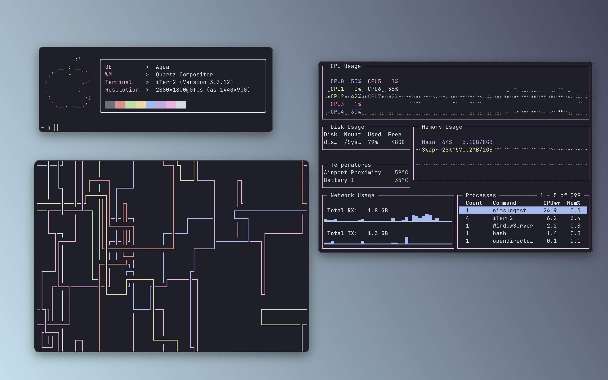

<h3 align="center">
	 
	
	Catppuccin for <a href="https://iterm2.com">iTerm</a>
	
</h3>

    
    
    

  

## Usage

1. Launch iTerm 2
2. Type CMD+i (⌘+i)
3. Navigate to the **Colors** tab
4. Click on **Color Presets**
5. Click on **Import**
6. Select the **catppuccin.itermcolors**
7. Click on **Color Presets** and choose catppuccin
8. Enjoy! :sparkles:

## Associations

  
Show

| Iterm Field | Catppuccin Color |
| ----------- | ---------------- |
| Foreground | Text |
| Bold | Text |
| Cursor | Text |
| Cursor Guide | Text |
| Background | Base |
| Selected Text | Base |
| Badge | Red |
| Cursor text | Base |
| Links | Lavender |
| Selection | Overlay0 |
| Black | Base |
| Black Bright | Surface1 |
| Red | Red |
| Red Bright | Red |
| Green | Green |
| Green Bright | Green |
| Yellow | Yellow |
| Yellow Bright | Yellow |
| Blue | Blue |
| Blue Bright | Blue |
| Magenta | Mauve |
| Magenta Bright | Mauve |
| Cyan | Sky |
| Cyan Bright | Sky |
| White | Text |
| White Bright | Text |

## 💝 Thanks to

-   [VictorTennekes](https://github.com/VictorTennekes)

&nbsp;

Copyright &copy; 2021-present <a href="https://github.com/catppuccin" target="_blank">Catppuccin Org</a>

