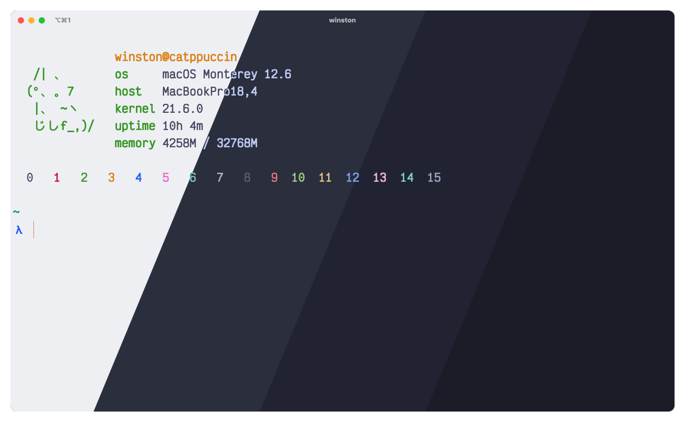
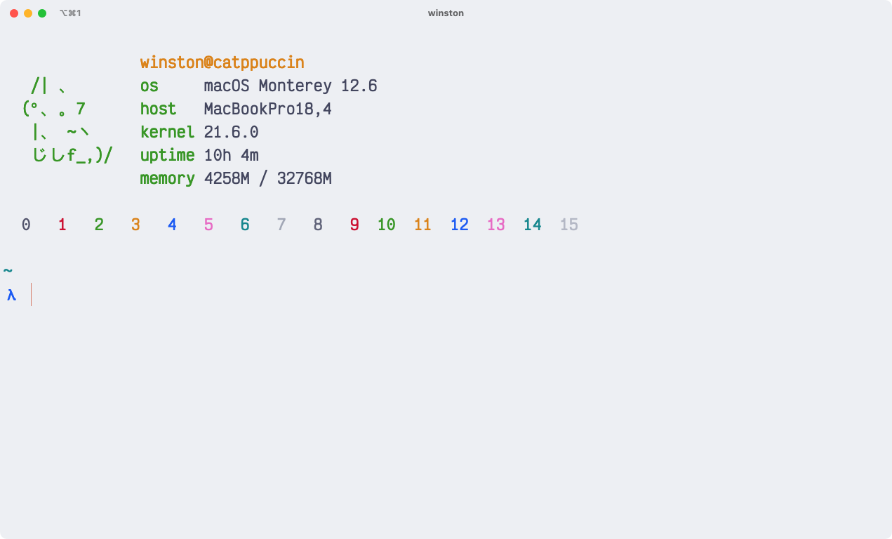
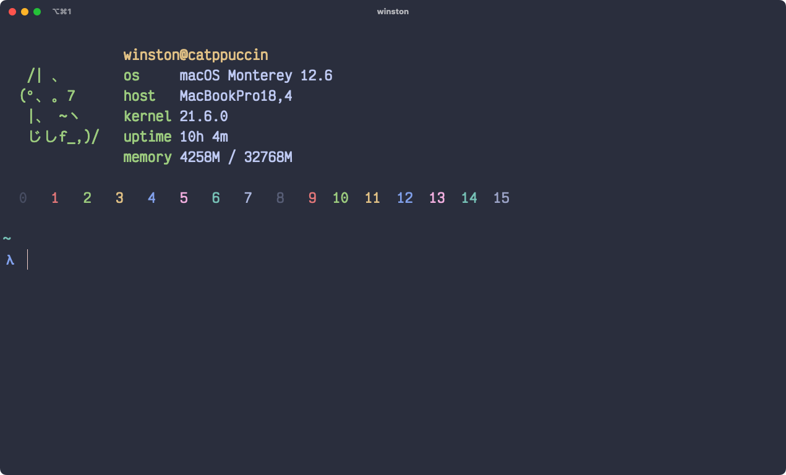
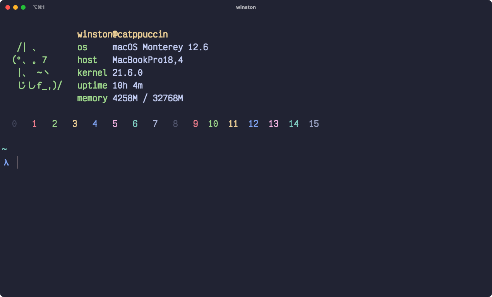
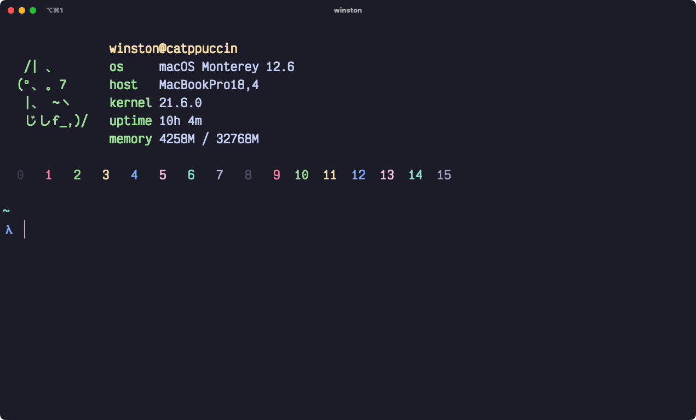

<h3 align="center">
	 
	
	Catppuccin for <a href="https://iterm2.com">iTerm</a>
	
</h3>

    
    
    

  

## Previews

🌻 Latte

🪴 Frappé

🌺 Macchiato

🌿 Mocha

## Usage

1. Download your preferred flavor(s) from [`colors/`](./colors/).
2. Launch iTerm and open settings (<kbd>⌘ (Cmd)</kbd>+<kbd>,</kbd>).
3. Select the **Profiles** tab and select your profile to edit.
4. Navigate to the **Colors** section > **Color Preset** > **Import**.
5. Select the file(s) downloaded in step 1.
6. Click on **Color Presets** again to choose your flavor.
7. Enjoy! :sparkles:

## 💝 Thanks to

- [VictorTennekes](https://github.com/VictorTennekes)
- [winston](https://github.com/nekowinston)

&nbsp;

Copyright &copy; 2021-present <a href="https://github.com/catppuccin" target="_blank">Catppuccin Org</a>

